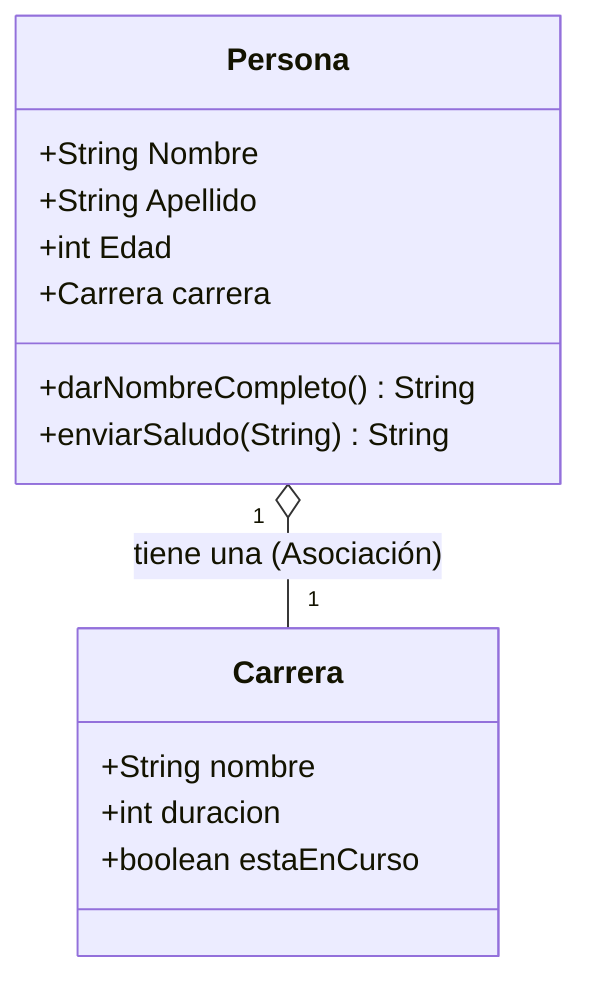

# Manipulación de Cadenas de Texto (`String`) en Java

Este proyecto contiene un ejemplo práctico sobre el uso de la clase `String` en Java y los métodos esenciales para inspeccionar, transformar y manipular cadenas de texto.

---

## 👨‍💻 Autor y Créditos

- **Desarrollador:** Caballero Urrego Dev
- **Fecha:** 07/09/2026

---

## 📌 Descripción del Proyecto

El archivo `App.java` demuestra cómo trabajar con cadenas de texto utilizando una variable de prueba con espacios de relleno al inicio y al final:

### 📌 Cadena de Ejemplo

El programa utiliza la siguiente variable de prueba con espacios en blanco de relleno para evaluar el comportamiento de cada método:

### 📌 Cadena de Ejemplo

El programa utiliza la siguiente variable de prueba con espacios en blanco de relleno para evaluar el comportamiento de cada método:

### 🛠️ Métodos Explicados en el Código

| Método                  | Descripción                                               | Ejemplo en Código                  |
| :---------------------- | :-------------------------------------------------------- | :--------------------------------- |
| `length()`              | Cuenta el número total de caracteres (incluye espacios).  | Mide la longitud de `texto`.       |
| `charAt(index)`         | Devuelve el carácter en la posición indicada (desde `0`). | Obtiene el primer carácter.        |
| `substring(start, end)` | Extrae un texto desde `start` hasta `end - 1`.            | Corta desde la posición 5 a la 15. |
| `toLowerCase()`         | Convierte todo el texto a minúsculas.                     | Pasa la cadena a minúsculas.       |
| `toUpperCase()`         | Convierte todo el texto a MAYÚSCULAS.                     | Pasa la cadena a mayúsculas.       |
| `indexOf(target)`       | Busca la posición donde inicia una palabra/carácter.      | Busca la palabra `"variable"`.     |
| `replace(old, new)`     | Reemplaza un texto por otro nuevo.                        | Cambia `"texto"` por `"parrafo"`.  |
| `contains(target)`      | Verifica si contiene un texto (`true`/`false`).           | Busca si contiene `"asignado"`.    |
| `trim()`                | Elimina espacios sobrantes al inicio y al final.          | Quita espacios en los bordes.      |

# ☕ Fundamentos de Java & Operadores

Bienvenido a la bitácora de aprendizaje y código del curso **Java desde Cero** por **serg code**. En este espacio se exploran los conceptos fundamentales del lenguaje Java, desde la declaración de variables hasta la implementación de lógica booleana y tablas de la verdad.

---

## 📌 Descripción del Proyecto

Este proyecto reúne ejercicios prácticos y explicaciones conceptuales para comprender el funcionamiento interno de Java. Se abarcan temas esenciales como:

- **Sintaxis y Estructura:** Uso de métodos principales (`main`) y manejo de archivos `.java`.
- **Operadores Aritméticos:** Operaciones elementales (`+`, `-`, `*`, `/`) y cálculo de residuo o paridad mediante el operador módulo (`%`).
- **Tipos de Datos:** Manejo de enteros (`int`), decimales (`double`) y tipos booleanos (`boolean`)[cite: 1].
- **Operadores de Asignación:** Modificación rápida de variables (`+=`, `-=`, `*=`, `/=`, `++`, `--`)[cite: 1].
- **Operadores de Comparación:** Evaluación relacional (`>`, `<`, `==`) que retornan valores booleanos[cite: 1].
- **Lógica Booleana:** Compuertas y lógica mediante los operadores `&&`, `||` y `!`[cite: 1].

---

## 📊 Tabla de la Verdad (Guía de Referencia)

| Operación    | Operador en Java | Condición para ser Verdadero (`true`)                      | Ejemplo                                 |         Resultado         |
| :----------- | :--------------: | :--------------------------------------------------------- | :-------------------------------------- | :-----------------------: |
| **AND** (Y)  |       `&&`       | Ambos operandos deben ser `true`                           | `true && true`<br>`true && false`       | **`true`**<br>**`false`** |
| **OR** (Ó)   |      `\|\|`      | Al menos uno de los operandos debe ser `true`              | `true \|\| false`<br>`false \|\| false` | **`true`**<br>**`false`** |
| **NOT** (NO) |       `!`        | Invierte el valor actual (de `true` a `false` y viceversa) | `!true`<br>`!false`                     | **`false`**<br>**`true`** |

## 10/09/2026

## Estructuras de control :

## Explicación del Código: Estructuras de Control en Java

Este programa demuestra el uso de **estructuras condicionales relacionales y lógicas** (`if`, `else if`, `else`) para evaluar el acceso de un usuario a un establecimiento según su edad.

### Flujo de Lógica:

- **`edad > 18 && edad <= 60`**: Permite el ingreso regular para personas en el rango de 19 a 60 años.
- **`edad > 60`**: Restringe el acceso a personas mayores de 60 años.
- **`edad == 18`**: Permite el acceso exacto a los 18 años con recordatorio de identificación.
- **`else`**: Deniega el acceso a menores de 18 años.

## 12/09/2026

## Estructuras de Control Iterativas: Bucle For y Bucles Anidados

El bucle `for` permite repetir un bloque de código un número determinado de veces. Su sintaxis básica es:

```java
for (inicialización; condición; actualización) {
    // Código a ejecutar
}
```

### Bucles Anidados (Triple Nivel)

En este ejercicio se implementaron tres bucles `for` anidados (variables `i`, `j` y `k`), donde cada variable itera del 1 al 3:

```java
for (i = 1; i <= 3; i++) {           // Nivel exterior (i)
    for (j = 1; j <= 3; j++) {       // Nivel intermedio (j)
        for (k = 1; k <= 3; k++) {   // Nivel interior (k)
            System.out.print("i:");
            System.out.print(i);
            System.out.print(" j:");
            System.out.print(j);
            System.out.print(" k:");
            System.out.println(k);
        }
    }
}
```

### Flujo de Ejecución:

- **De adentro hacia afuera:** Por cada incremento del bucle exterior (`i`), el bucle intermedio (`j`) avanza un paso, y el interior (`k`) se ejecuta por completo de 1 a 3.
- **Total de iteraciones:** Al tener 3 niveles de 3 repeticiones cada uno, se generan $3 \times 3 \times 3 = \mathbf{27}$ combinaciones en total (desde `i:1 j:1 k:1` hasta `i:3 j:3 k:3`).

### Manejo de Salida en Consola:

- **`System.out.print()`:** Imprime texto o variables sin salto de línea, permitiendo armar los datos de `i`, `j` y `k` en la misma fila.
- **`System.out.println()`:** Imprime el valor final de `k` e introduce un salto de línea, preparando la consola para la siguiente iteración.

---

## Estructuras de Control Iterativas: Bucle While

El bucle `while` ejecuta un bloque de instrucciones de manera repetitiva **mientras una condición booleana sea verdadera (`true`)**. La condición se evalúa antes de cada iteración.

### Sintaxis Básica

```java
while (condición) {
    // Código a ejecutar mientras la condición sea verdadera
    // Actualización de la variable de control
}
```

### Código Implementado

```java
public class App {
    public static void main(String[] args) throws Exception {
        // Estructuras de control iterativas: while
        int contador = 1;

        while (contador <= 5) {
            System.out.println(contador);
            // Actualización de la variable para evitar un bucle infinito
            contador++;
        }
        System.err.println(contador);
    }
}
```

### 🧠 Flujo de Ejecución:

1. **Inicialización (`int contador = 1;`):** Se define la variable de control antes de entrar al bucle.
2. **Evaluación de la condición (`contador <= 5`):**
   - **Vuelta 1:** `contador = 1` $\rightarrow$ Imprime `1`, incrementa a `2`.
   - **Vuelta 2:** `contador = 2` $\rightarrow$ Imprime `2`, incrementa a `3`.
   - **Vuelta 3:** `contador = 3` $\rightarrow$ Imprime `3`, incrementa a `4`.
   - **Vuelta 4:** `contador = 4` $\rightarrow$ Imprime `4`, incrementa a `5`.
   - **Vuelta 5:** `contador = 5` $\rightarrow$ Imprime `5`, incrementa a `6`.
3. **Condición de Parada:** Al volver a evaluar, `6 <= 5` es `false`, por lo que el ciclo termina.
4. **Valor Final Fuera del Bucle:** Al salir del `while`, la variable `contador` conserva el valor `6`.

### 📌 Puntos Clave:

- **Prevención de Bucle Infinito:** Es fundamental la actualización `contador++`. Si se omite, la condición siempre evaluará a `true` y el programa nunca terminará.
- **Diferencia entre `System.out` y `System.err`:**
  - **`System.out.println()`**: Envía datos al canal de salida estándar (texto normal).
  - **`System.err.println()`**: Envía datos al canal de salida de error estándar (usualmente resaltado en color rojo en terminales/IDEs o usado para depuración y avisos).

---

## Arreglos (Arrays / Vectores)

Los **arreglos** son estructuras de datos que almacenan un conjunto de valores del mismo tipo de forma secuencial. Cada elemento dentro del arreglo es accesible mediante una posición numérica denominada **índice**.

### 📌 Características Principales:

- **Índice base cero (`0`):** El primer elemento se posiciona en el índice `0` y el último en `longitud - 1`.
- **Tipo de dato homogéneo:** Todos los elementos deben pertenecer al mismo tipo (`int[]`, `char[]`, `String[]`, etc.).
- **Acceso y modificación directa:** Se accede o reasigna un valor usando la sintaxis `arreglo[indice]`.
- **Propiedad `.length`:** Atributo que devuelve el tamaño total de elementos del arreglo.

---

### 💻 Declaración, Inicialización y Modificación

```java
// 1. Declaración asignando tamaño en memoria:
int[] numeros = new int[5];

// 2. Inicialización directa con valores:
int[] numeros = { 10, 20, 30, 40, 50 };

// Modificación de un elemento por su índice:
numeros[2] = 70; // El elemento en el índice 2 pasa de 30 a 70
```

---

### 🔄 Formas de Recorrer un Arreglo

#### 1. Bucle `for-each` (Bucle Mejorado)

Recorre cada elemento secuencialmente sin necesidad de gestionar manualmente la condición de parada o el índice:

```java
int indice = 0;
for (int numero : numeros) {
    System.out.println(numero); // Imprime el valor
    System.out.println(indice); // Imprime el índice de referencia
    indice++;
}
```

#### 2. Bucle `for` Clásico usando `.length`

Permite tener control total sobre el índice durante la iteración:

```java
for (int index = 0; index < numeros.length; index++) {
    System.out.println(numeros[index]); // Acceso al valor en el índice actual
    System.out.println(index);          // Índice actual (0 a 4)
}
```

---

### 💡 Nota: `.length` (Arreglos) vs `.length()` (Strings)

- **`arreglo.length`**: Es un **atributo/propiedad** de los arreglos (sin paréntesis) que contiene el tamaño del array.
- **`string.length()`**: Es un **método** de la clase `String` (con paréntesis) que calcula el conteo de caracteres (ej. `"Abecedario".length()` retorna `10`).

---

## 13/09/2026

## 🎮 Proyecto Práctico: Juego del Ahorcado (Hangman Game)

En este ejercicio práctico se integran los conceptos fundamentales aprendidos hasta el momento: **Manejo de Cadenas (`String`)**, **Arreglos (`char[]`)**, **Estructuras de Control Condicionales (`if/else`)** e **Iterativas (`while`, `for`)**, y **Entrada de Datos por Consola (`Scanner`)**.

### 🎯 Objetivo del Juego

Adivinar una palabra secreta carácter por carácter antes de que se agoten los intentos permitidos (en este caso, 10 intentos).

---

### 💻 Código Implementado (`Ahorcado.java`)

```java
import java.util.Scanner;

public class Ahorcado {

  public static void main(String[] args) throws Exception {
    // Clase Scanner que nos permite que el usuario escriba
    Scanner scanner = new Scanner(System.in);

    // Declaraciones y asignaciones de variables
    String PalabraSecreta = "inteligencia";
    int IntentosMaximos = 10;
    int Intentos = 0;
    boolean PalabraAdivinada = false;

    // Arreglos: progreso de las letras adivinadas
    char[] LetrasAdivinadas = new char[PalabraSecreta.length()];

    // Estructura de control: Iterativa (Bucle for) para inicializar con guiones '_'
    for (int i = 0; i < LetrasAdivinadas.length; i++) {
      LetrasAdivinadas[i] = '_';
    }

    // Estructura de control: Iterativa (While)
    // Se ejecuta mientras la palabra no haya sido adivinada y queden intentos disponibles
    while (!PalabraAdivinada && Intentos < IntentosMaximos) {
      System.out.println(
          "Palabra a adivinar : " + String.valueOf(LetrasAdivinadas) + " (" + PalabraSecreta.length() + " letras)");
      System.out.println("Introduce una letra, por favor");

      // Capturamos el primer carácter introducido y lo convertimos a minúscula
      char letra = Character.toLowerCase(scanner.next().charAt(0));

      boolean LetraCorrecta = false;

      // Estructura de control: Iterativa (Bucle for) para buscar coincidencias
      for (int i = 0; i < PalabraSecreta.length(); i++) {
        // Estructura de control Condicional: si la letra coincide, actualizamos el arreglo
        if (PalabraSecreta.charAt(i) == letra) {
          LetrasAdivinadas[i] = letra;
          LetraCorrecta = true;
        }
      }

      // Si la letra no fue acertada, se penaliza sumando un intento
      if (!LetraCorrecta) {
        Intentos++;
        System.out.println("¡Incorrecto!  Te quedan " + (IntentosMaximos - Intentos) + " Intentos");
      }

      // Comprobamos si el arreglo actual coincide completamente con la palabra secreta
      if (String.valueOf(LetrasAdivinadas).equals(PalabraSecreta)) {
        PalabraAdivinada = true;
        System.out.println("¡Felicidades! Has adivinado la palabra: " + PalabraSecreta);
      }
    }

    // Mensaje de fin de juego si agotó los intentos sin adivinar
    if (!PalabraAdivinada) {
      System.out.println("¡Has perdido! Te quedaste sin intentos.");
    }

    scanner.close();
  }
}
```

---

### 🧠 Conceptos Clave Aplicados

| Componente / Método                                       | ¿Para qué se utiliza en este ejercicio?                                                   |
| :-------------------------------------------------------- | :---------------------------------------------------------------------------------------- |
| `new char[PalabraSecreta.length()]`                       | Crea un arreglo de caracteres con la misma longitud que la palabra secreta.               |
| `Character.toLowerCase(...)`                              | Normaliza el carácter recibido para que el juego sea insensible a mayúsculas/minúsculas.  |
| `scanner.next().charAt(0)`                                | Lee el texto ingresado por el usuario y extrae únicamente la primera letra (índice `0`).  |
| `PalabraSecreta.charAt(i)`                                | Compara cada letra de la palabra secreta con la letra ingresada en el bucle.              |
| `String.valueOf(LetrasAdivinadas)`                        | Convierte el arreglo `char[]` a un `String` para imprimirlo o compararlo con `.equals()`. |
| `while (!PalabraAdivinada && Intentos < IntentosMaximos)` | Control del ciclo principal mediante compuertas lógicas (`!`, `&&`, `<`).                 |
| `if (!LetraCorrecta)`                                     | Bandera de estado booleana para descontar intentos únicamente tras fallar.                |

---

### 🔄 Flujo de Ejecución del Programa

1. **Ciclo de Turnos (`while`):**
   - Muestra el estado del tablero con las letras descubiertas hasta el momento.
   - Pide al usuario ingresar una letra y la procesa en minúscula.
   - Recorre la palabra secreta: si la letra existe, reemplaza los guiones en sus posiciones correspondientes y marca `LetraCorrecta = true`.
   - Si no acertó (`!LetraCorrecta`), descuenta un intento y notifica al usuario.
   - Comprueba si todas las letras fueron adivinadas con `String.valueOf(LetrasAdivinadas).equals(PalabraSecreta)`.
2. **Condición de Salida:** Si adivina la palabra, felicita al jugador. Si los intentos llegan al límite (`10`), muestra el mensaje de derrota y cierra el objeto `Scanner`.

---

## 16/09/2026

## 🧱 Introducción a la Programación Orientada a Objetos (POO)

En esta sesión se da el salto fundamental de la programación estructurada/procedimental hacia la **Programación Orientada a Objetos (POO)**. Este paradigma permite estructurar el código modelando elementos y conceptos del mundo real mediante **clases** (plantillas o moldes) y **objetos** (instancias creadas a partir de dichas plantillas).

---

### 🎯 Conceptos Fundamentales

1. **Clase (`class`):** Es el molde, plano o plantilla conceptual. Define qué características (atributos) y qué acciones (métodos) tendrán los elementos que se fabriquen a partir de ella.
2. **Objeto / Instancia:** Es el elemento real y concreto que se crea en memoria a partir de una clase mediante la palabra reservada `new`. Cada objeto tiene su propio espacio de memoria e identidad.
3. **Atributos (Estado / Características):** Son las variables declaradas dentro de la clase. Almacenan los datos que describen el estado particular de cada objeto.
4. **Métodos (Comportamiento / Acciones):** Son bloques de código (funciones) asociadas al objeto que definen lo que este puede hacer o cómo responde ante ciertas solicitudes.

---

### 💻 Código Implementado

El ejercicio se divide en dos archivos para mantener la separación de responsabilidades:

#### 1. Definición del Molde: `Persona.java`

```java
public class Persona {
  // Atributos y características de un objeto (Estado)
  String Nombre;
  String Apellido;
  int Edad;

  // Métodos: Son los comportamientos de un objeto (Acciones)

  // Método sin parámetros: procesa y concatena atributos del propio objeto
  public String darNombreCompleto() {
    return Apellido + ", " + Nombre;
  }

  // Método con parámetros y lógica condicional:
  // Evalúa la edad del objeto para determinar el tipo de saludo
  public String enviarSaludo(String saludado) {
    if (Edad > 40) return "Buenos dias, querido " + saludado;
    return "Hola, ¿como estas " + saludado + "?";
  }
}
```

#### 2. Creación y Uso de Instancias: `App.java`

```java
public class App {
        public static void main(String[] args) throws Exception {
                Persona persona1 = new Persona();
                persona1.Nombre = "Leonardo";
                persona1.Apellido = "Dicaprio";
                persona1.Edad = 25;
                // Creación del segundo objeto independiente (persona2)
                Persona persona2 = new Persona();
                persona2.Nombre = "Mariana";
                persona2.Apellido = "Alvarez";
                persona2.Edad = 46;

                String saludado = " Desarollador Urrego";
                // Invocación del método darNombreCompleto() y lectura de atributos

                // persona 1
                System.out.println(persona1.darNombreCompleto() + ", " + "tiene " + persona1.Edad + " años.");
                // persona 2
                System.out.println(persona2.darNombreCompleto() + ", " + "tiene " + persona2.Edad + " años.");

                System.out.println(persona1.enviarSaludo(saludado));
                System.out.println(persona2.enviarSaludo(" Desarollador"));
        }

}
```

---

### 🧠 Conceptos Clave Aplicados

| Concepto / Sintaxis                           | ¿Para qué se utiliza en este ejercicio?                                                                                                                             |
| :-------------------------------------------- | :------------------------------------------------------------------------------------------------------------------------------------------------------------------ |
| `Persona persona1 = new Persona();`           | **Instanciación:** Crea un objeto nuevo en memoria a partir de la clase `Persona`.                                                                                  |
| `persona1.Nombre = "Sebastian";`              | **Operador punto (`.`):** Permite acceder y asignar valores a los atributos públicos de cada objeto.                                                                |
| `public String darNombreCompleto()`           | **Método con retorno (`return`):** Devuelve una cadena con formato `"Apellido, Nombre"` leyendo los atributos internos de la instancia.                             |
| `public String enviarSaludo(String saludado)` | **Paso de parámetros y lógica interna:** Recibe un valor exterior (`saludado`) y lo combina con el estado interno (`Edad > 40`) para decidir la respuesta adecuada. |
| **Independencia de Instancias**               | Aunque `persona1` y `persona2` provienen de la misma clase, sus datos en memoria son totalmente aislados e independientes.                                          |

---

### 🔄 Flujo de Ejecución y Salida en Consola

1. **Instanciación:** Se reservan dos espacios de memoria distintos para `persona1` y `persona2`.
2. **Asignación de Estado:** Se asignan los nombres, apellidos y edades correspondientes a cada sujeto.
3. **Formateo de Nombre:** Ambos objetos invocan su método `darNombreCompleto()`, imprimiendo el formato estándar configurado en la clase.
4. **Evaluación Condicional según Estado:**
   - Para `persona1` (Edad 25): la condición `25 > 40` resulta `false`, produciendo un saludo casual.
   - Para `persona2` (Edad 46): la condición `46 > 40` resulta `true`, produciendo un saludo formal y respetuoso.

#### 🖥️ Salida en Consola:

```text
Dicaprio, Leonardo, tiene 25 años.
Alvarez, Mariana, tiene 46 años.
Hola, ¿como estas Desarollador Urrego?
Buenos dias,querido Desarollador
```

---

## 17/09/2026

## 🔗 Relaciones entre Clases: Atributos de Tipo Objeto (Composición y Asociación)

En esta sesión se da un salto fundamental en el diseño de software orientado a objetos: **hacer que dos o más clases colaboren entre sí**. En lugar de almacenar únicamente tipos de datos simples (`int`, `boolean`, `String`), una clase puede tener como atributo **una instancia de otra clase**.

A este principio en POO se le conoce como la relación **"Tiene-Un" (*Has-A*)**.

---

### 💡 ¿Por qué no poner los atributos directamente en `Persona`?

Podríamos haber agregado en `Persona.java` variables como `String nombreCarrera;` o `int duracionCarrera;`. Sin embargo, separar los conceptos en clases independientes aporta grandes ventajas:

1. **Modularidad y Responsabilidad Única:** La clase `Persona` se encarga únicamente de los datos humanos (nombre, apellido, edad), mientras que `Carrera` se responsabiliza de la información académica.
2. **Reutilización:** La misma clase `Carrera` puede reutilizarse en el futuro para universidades, facultades o registros de inscripción sin duplicar código.
3. **Escalabilidad:** Si en el futuro una carrera necesita más datos (como materias, créditos o promedio de aprobación), solo se modifica `Carrera.java` sin alterar el molde de `Persona`.

---

### 🗺️ Representación Visual en Memoria (Heap)

Cuando creamos los objetos y los vinculamos en Java, ocurre lo siguiente en la memoria:



En memoria, `persona1.carrera` no almacena físicamente una copia de la carrera, sino un **puntero o referencia** que apunta directamente a la dirección de memoria donde se encuentra `carrera1`.

---

### 💻 Código Implementado y Análisis Paso a Paso

El avance involucra tres archivos dentro de `src/`:

#### 1. Definición del Objeto Componente: `Carrera.java`

```java
public class Carrera {
  String nombre;       // Denominación oficial de la carrera universitaria
  int duracion;        // Tiempo estimado de la carrera expresado en años
  boolean estaEnCurso; // Estado actual: true (estudiando) | false (egresado/graduado)
}
```

- **Propósito:** Actúa como plantilla para representar cualquier titulación académica de forma aislada.

#### 2. Definición del Objeto Contenedor: `Persona.java`

```java
public class Persona {
  // Atributos y características de un objeto
  String Nombre;
  String Apellido;
  int Edad;
  
  // Atributo de tipo objeto: Relación Has-A ("Una persona TIENE UNA carrera")
  Carrera carrera;

  // Métodos: Comportamientos del objeto
  public String darNombreCompleto() {
    return Apellido + ", " + Nombre;
  }

  public String enviarSaludo(String saludado) {
    if (Edad > 40)
      return "Buenos dias,querido" + saludado;
    return "Hola, ¿como estas" + saludado + "?";
  }
}
```

> [!NOTE]
> Al declarar `Carrera carrera;`, el valor por defecto de este atributo antes de asignarle un objeto es **`null`** (no apunta a ninguna dirección de memoria).

#### 3. Instanciación, Enlace e Impresión: `App.java`

```java
public class App {
    public static void main(String[] args) throws Exception {
        // ==========================================
        // CASO 1: Leonardo DiCaprio (Graduado)
        // ==========================================
        Persona persona1 = new Persona();
        persona1.Nombre = "Leonardo";
        persona1.Apellido = "Dicaprio";
        persona1.Edad = 25;

        // Se crea el objeto Carrera de forma independiente
        Carrera carrera1 = new Carrera();
        carrera1.nombre = "Ingenieria en computacion";
        carrera1.duracion = 6;
        carrera1.estaEnCurso = false; // Ya no cursa, está recibido

        // VINCULACIÓN: Se enlaza carrera1 a persona1
        persona1.carrera = carrera1;

        // ==========================================
        // CASO 2: Mariana Álvarez (Cursando actualmente)
        // ==========================================
        Persona persona2 = new Persona();
        persona2.Nombre = "Mariana";
        persona2.Apellido = "Alvarez";
        persona2.Edad = 46;

        // Se crea la segunda Carrera independiente
        Carrera carrera2 = new Carrera();
        carrera2.nombre = "Ingenieria en sistemas";
        carrera2.duracion = 6;
        carrera2.estaEnCurso = true; // Sigue estudiando

        // VINCULACIÓN: Se enlaza carrera2 a persona2
        persona2.carrera = carrera2;

        String saludado = " Desarollador Urrego";

        // ==========================================
        // LECTURA CON ACCESO ENCADENADO
        // ==========================================
        // Para persona 1:
        System.out.println(persona1.darNombreCompleto() + ", " + "tiene " + persona1.Edad 
            + " años y esta recibido de " + persona1.carrera.nombre);
        
        // Para persona 2:
        System.out.println(persona2.darNombreCompleto() + ", " + "tiene " + persona2.Edad
            + " años y eta cursando " + persona2.carrera.nombre);

        // System.out.println(persona1.enviarSaludo(saludado));
        // System.out.println(persona2.enviarSaludo(" Desarollador"));
    }
}
```

---

### 🔍 Análisis Detallado del Mecanismo de Enlace

#### ¿Cómo funciona el Acceso Encadenado (`persona1.carrera.nombre`)?
1. `persona1`: Se accede a la instancia de la persona.
2. `.carrera`: Se sigue la referencia interna hacia el objeto `Carrera` vinculado (`carrera1`).
3. `.nombre`: Se obtiene el valor del atributo `nombre` contenido dentro de ese objeto de carrera (`"Ingenieria en computacion"`).

> [!WARNING]
> **El Error Común: `NullPointerException` (NPE)**
> Si intentas ejecutar `System.out.println(persona1.carrera.nombre);` **antes** de la línea `persona1.carrera = carrera1;`, el programa lanzará un error en tiempo de ejecución (`java.lang.NullPointerException`). Esto ocurre porque `carrera` aún valdría `null`, y Java no puede buscar un atributo `.nombre` en un objeto inexistente en memoria.

---

### 🧠 Tabla de Conceptos Clave Aplicados

| Sintaxis / Concepto | Significado Técnico | Utilidad Práctica |
| :--- | :--- | :--- |
| `Carrera carrera;` | Atributo por referencia | Permite que una clase guarde la dirección de memoria de otro objeto. |
| `new Carrera();` | Instanciación | Reserva espacio en memoria Heap para alojar los datos de una nueva carrera. |
| `persona1.carrera = carrera1;` | Enlace / Asociación | Conecta ambas entidades asignando la referencia del objeto `carrera1` a la propiedad interna de `persona1`. |
| `persona1.carrera.nombre` | Operador punto encadenado | Permite navegar niveles de objetos anidados para leer o modificar datos profundos. |
| `carrera.estaEnCurso` | Bandera de estado (`boolean`) | Determina la lógica de negocio (si la persona ya es graduada o sigue siendo estudiante). |

---

### 🖥️ Salida en Consola y Validación

Al compilar y ejecutar `App.java`, la salida final verificada es:

```text
Dicaprio, Leonardo, tiene 25 años y esta recibido de Ingenieria en computacion
Alvarez, Mariana, tiene 46 años y eta cursando Ingenieria en sistemas
```

---

## 18/09/2026

## 🏗️ Constructores, la Palabra Clave `this` y Sobrecarga de Constructores

En esta sesión se optimiza la creación de objetos en Java mediante el uso de **Constructores**. Anteriormente, los atributos se asignaban manualmente uno por uno después de crear la instancia (`persona1.Nombre = ...;`). Con los constructores, el objeto nace completamente inicializado y en un estado coherente desde el primer momento.

---

### 🎯 Conceptos Fundamentales

1. **¿Qué es un Constructor?**
   - Es un bloque de código especial que se ejecuta automáticamente al instanciar un objeto con el operador `new`.
   - **Reglas obligatorias:**
     - Lleva **exactamente el mismo nombre** de la clase (respetando mayúsculas y minúsculas).
     - **No define ningún tipo de retorno** (ni siquiera `void`).
   - **Propósito:** Inicializar atributos, reservar recursos y garantizar que el objeto no quede con datos nulos o inconsistentes.

2. **La Palabra Clave `this`:**
   - Es una referencia que apunta al **objeto actual** que está ejecutando el código.
   - **Resolución de Ambigüedad (*Shadowing*):** Si el parámetro recibido en el constructor tiene el mismo nombre que el atributo de la clase, se utiliza `this.atributo = parametro;` para diferenciar la variable de instancia del parámetro local.

3. **Sobrecarga de Constructores (*Constructor Overloading*):**
   - Java permite definir más de un constructor en la misma clase, siempre y cuando tengan **diferente número o tipo de parámetros** (diferente firma).
   - Esto otorga flexibilidad: se puede instanciar un objeto con todos sus datos completos o solo con los datos básicos indispensables.

---

### 💻 Código Implementado

#### 1. Constructores en `Carrera.java`

```java
public class Carrera {
  String nombre;
  int duracion;
  boolean estaEnCurso;

  // Constructor Completo: inicializa todos los atributos
  public Carrera(String nombre, int duracion, boolean estaEnCurso) {
    this.nombre = nombre;
    this.duracion = duracion;
    this.estaEnCurso = estaEnCurso;
  }

  // Constructor Sobrecargado: solo requiere el nombre de la carrera
  public Carrera(String nombre) {
    this.nombre = nombre;
  }
}
```

#### 2. Constructores y Composición en `Persona.java`

```java
public class Persona {
  // Atributos
  String Nombre;
  String Apellido;
  int Edad;
  Carrera carrera;

  // Constructor 1 (Completo): recibe los datos de la persona y de la carrera
  public Persona(String nombre, String apellido, int edad, String nombreCarrera, int duracionCarrera,
      boolean estaEnCurso) {
    // Instancia internamente la Carrera llamando a su constructor
    carrera = new Carrera(nombreCarrera, duracionCarrera, estaEnCurso);
    this.Nombre = nombre;
    this.Apellido = apellido;
    this.Edad = edad;
  }

  // Constructor 2 (Sobrecarga): crea la carrera usando solo su nombre
  public Persona(String nombre, String apellido, int edad, String nombreCarrera) {
    carrera = new Carrera(nombreCarrera);
    this.Nombre = nombre;
    this.Apellido = apellido;
    this.Edad = edad;
  }

  // Métodos
  public String darNombreCompleto() {
    return Apellido + ", " + Nombre;
  }

  public String enviarSaludo(String saludado) {
    if (Edad > 40)
      return "Buenos dias,querido" + saludado;
    return "Hola, ¿como estas" + saludado + "?";
  }
}
```

#### 3. Uso en `App.java`

```java
public class App {
    public static void main(String[] args) throws Exception {
        // Creación limpia en una sola línea gracias al constructor
        Persona persona1 = new Persona("pedro", "Pascal", 40, "Mandaloriano", 5, true);

        // Impresión de datos
        System.out.println(persona1.darNombreCompleto() + ", " + "tiene " + persona1.Edad
                + " años y esta recibida de " + persona1.carrera.nombre);
    }
}
```

---

### 🧠 Tabla Comparativa: Asignación Manual vs Constructores

| Característica | Asignación Manual Anterior | Con Constructores |
| :--- | :--- | :--- |
| **Líneas de código** | Múltiples líneas (`obj.a = ...; obj.b = ...;`) | Una sola línea compacta (`new Clase(arg1, arg2);`) |
| **Riesgo de `null`** | Alto (si olvidas asignar un atributo queda en `null` o `0`) | Mínimo (el constructor exige los parámetros obligatorios) |
| **Encapsulación** | Débil (los atributos debían ser accesibles directamente) | Fuerte (prepara el camino para hacerlos `private`) |
| **Flexibilidad** | Sin control de opciones de inicio | Alta (mediante sobrecarga de constructores) |

---

### 🖥️ Salida en Consola:

```text
Pascal, pedro, tiene 40 años y esta recibida de Mandaloriano
```

---
