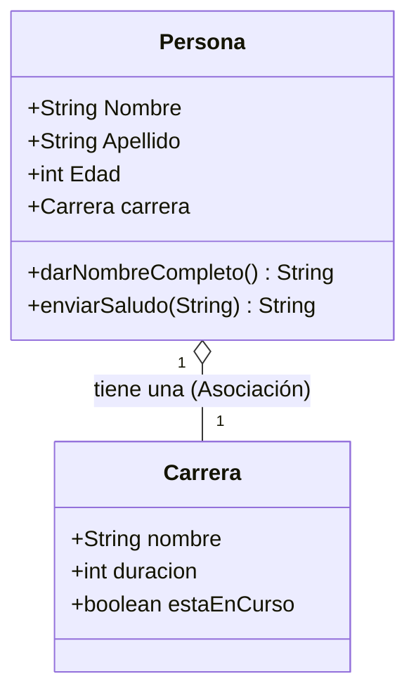
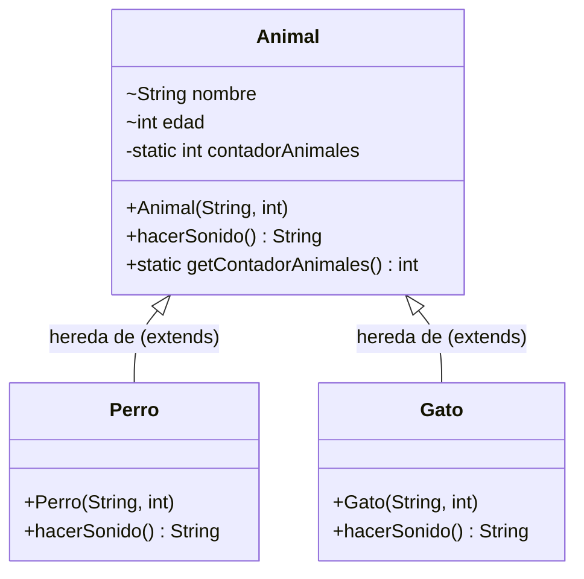

# ☕ Curso Java desde Cero — Bitácora de Aprendizaje

> Repositorio de apuntes, ejercicios prácticos y proyectos del curso **Java desde Cero** (por Sergie Code), desarrollado y documentado paso a paso por **Caballero Urrego Dev**.

---

## 👨‍💻 Información General

- **Desarrollador:** Caballero Urrego Dev
- **Fecha de Inicio:** 07/09/2026
- **Lenguaje:** Java (OpenJDK 17+)
- **Entorno de Desarrollo:** Visual Studio Code / Antigravity IDE
- **Objetivo:** Documentar el progreso diario, código fuente, explicaciones conceptuales y buenas prácticas de programación estructurada y Programación Orientada a Objetos (POO).

---

## 📑 Tabla de Contenidos

1. [📅 07/09/2026 — Fundamentos, Operadores y Cadenas (String)](#-07092026--fundamentos-operadores-y-cadenas-string)
   - [Fundamentos y Operadores](#-fundamentos-y-operadores)
   - [Tabla de la Verdad (Guía de Referencia)](#-tabla-de-la-verdad-guía-de-referencia)
   - [Manipulación de Cadenas de Texto (`String`)](#-manipulación-de-cadenas-de-texto-string)
2. [📅 10/09/2026 — Estructuras de Control Condicionales](#-10092026--estructuras-de-control-condicionales)
   - [Condicionales `if`, `else if`, `else`](#-condicionales-if-else-if-else)
3. [📅 12/09/2026 — Estructuras de Control Iterativas y Arreglos](#-12092026--estructuras-de-control-iterativas-y-arreglos)
   - [Bucle `for` y Bucles Anidados (Triple Nivel)](#-bucle-for-y-bucles-anidados-triple-nivel)
   - [Bucle `while`](#-bucle-while)
   - [Arreglos (Arrays / Vectores)](#-arreglos-arrays--vectores)
4. [📅 13/09/2026 — Proyecto Práctico: Juego del Ahorcado (Hangman Game)](#-13092026--proyecto-práctico-juego-del-ahorcado-hangman-game)
5. [📅 16/09/2026 — Introducción a la Programación Orientada a Objetos (POO)](#-16092026--introducción-a-la-programación-orientada-a-objetos-poo)
   - [Conceptos Fundamentales de POO](#-conceptos-fundamentales-de-poo)
   - [Código y Salida en Consola](#-código-implementado-poo-básica)
6. [📅 17/09/2026 — Relaciones entre Clases: Composición y Asociación](#-17092026--relaciones-entre-clases-composición-y-asociación)
   - [Relación Tiene-Un (_Has-A_)](#-relación-tiene-un-has-a)
   - [Diagrama de Clases (Mermaid)](#-representación-visual-en-memoria-heap)
   - [Mecanismo de Enlace y Prevención de `NullPointerException`](#-análisis-del-mecanismo-de-enlace)
7. [📅 18/09/2026 — Constructores, Palabra Clave `this` y Encapsulamiento](#-18092026--constructores-palabra-clave-this-y-encapsulamiento)
   - [Constructores y Sobrecarga](#-constructores-y-sobrecarga-de-constructores)
   - [Encapsulamiento: Modificador `private`, Getters y Setters](#-encapsulamiento-modificador-private-getters-y-setters)
8. [📅 18/09/2026 — Herencia, Palabra Clave `super`, Sobrescritura (`@Override`) y Miembros Estáticos (`static`)](#-18092026--herencia-palabra-clave-super-sobrescritura-de-métodos-override-y-miembros-estáticos-static)
   - [El Concepto de Herencia (Relación Es-Un / Is-A)](#-el-concepto-de-herencia-relación-es-un--is-a)
   - [Diagrama de Jerarquía de Clases (Mermaid)](#-diagrama-de-jerarquía-de-clases-mermaid)
   - [La Palabra Clave `super` y Constructores](#-la-palabra-clave-super-y-constructores)
   - [Sobrescritura de Métodos y Anotación `@Override`](#-sobrescritura-de-métodos-y-anotación-override)
   - [Miembros Estáticos (`static`) y Contador Global de Instancias](#-miembros-estáticos-static-y-contador-global-de-instancias)
   - [Código Actual del Proyecto: Herencia y Atributos Estáticos](#-código-actual-del-proyecto-herencia-y-atributos-estáticos)
9. [📅 18/09/2026 — Clase `Veterinaria` y Atributos Estáticos](#-18092026--clase-veterinaria-y-atributos-estáticos)
   - [Uso de `static` para datos globales](#-uso-de-static-para-datos-globales)
   - [Código de la clase `Veterinaria`](#-código-de-la-clase-veterinaria)
   - [Demostración en `App.java`](#-demostración-en-appjava)

---

## 📅 07/09/2026 — Fundamentos, Operadores y Cadenas (String)

### ☕ Fundamentos y Operadores

En esta primera etapa se exploran los pilares esenciales del lenguaje Java:

- **Sintaxis y Estructura:** Definición de clases, método principal (`public static void main(String[] args)`) y ejecución de archivos `.java`.
- **Operadores Aritméticos:** Operaciones elementales (`+`, `-`, `*`, `/`) y cálculo de residuo o paridad mediante el operador módulo (`%`).
- **Tipos de Datos Primitivos y Referenciados:** Enteros (`int`), decimales (`double`), booleanos (`boolean`) y cadenas (`String`).
- **Operadores de Asignación Compuesta:** Incremento, decremento y reasignación rápida (`+=`, `-=`, `*=`, `/=`, `++`, `--`).
- **Operadores de Comparación:** Evaluación relacional (`>`, `<`, `>=`, `<=`, `==`, `!=`) que producen valores booleanos.
- **Lógica Booleana:** Compuertas lógicas mediante los operadores `&&` (AND), `||` (OR) y `!` (NOT).

---

### 📊 Tabla de la Verdad (Guía de Referencia)

| Operación    | Operador en Java | Condición para ser Verdadero (`true`)         | Ejemplo                                 |         Resultado         |
| :----------- | :--------------: | :-------------------------------------------- | :-------------------------------------- | :-----------------------: |
| **AND** (Y)  |       `&&`       | Ambos operandos deben ser `true`              | `true && true`<br>`true && false`       | **`true`**<br>**`false`** |
| **OR** (Ó)   |      `\|\|`      | Al menos uno de los operandos debe ser `true` | `true \|\| false`<br>`false \|\| false` | **`true`**<br>**`false`** |
| **NOT** (NO) |       `!`        | Invierte el valor booleano actual             | `!true`<br>`!false`                     | **`false`**<br>**`true`** |

---

### 🔤 Manipulación de Cadenas de Texto (`String`)

Java trata las cadenas como objetos de la clase `java.lang.String`. A continuación se detalla el uso de sus métodos más frecuentes.

#### Cadena de Ejemplo

```java
String texto = "   Este es un texto asignado a una variable String   ";
```

#### 🛠️ Métodos Esenciales de la Clase `String`

| Método                  | Descripción                                                                            | Ejemplo de Uso                      |
| :---------------------- | :------------------------------------------------------------------------------------- | :---------------------------------- |
| `length()`              | Cuenta el número total de caracteres (incluyendo espacios).                            | `texto.length()`                    |
| `charAt(index)`         | Retorna el carácter en la posición indicada (índice base `0`).                         | `texto.charAt(3)`                   |
| `substring(start, end)` | Extrae un fragmento de texto desde `start` hasta `end - 1`.                            | `texto.substring(5, 15)`            |
| `toLowerCase()`         | Convierte todos los caracteres a minúsculas.                                           | `texto.toLowerCase()`               |
| `toUpperCase()`         | Convierte todos los caracteres a MAYÚSCULAS.                                           | `texto.toUpperCase()`               |
| `indexOf(target)`       | Devuelve el índice de la primera coincidencia del término buscado (`-1` si no existe). | `texto.indexOf("variable")`         |
| `replace(old, new)`     | Reemplaza todas las ocurrencias de una subcadena por una nueva.                        | `texto.replace("texto", "párrafo")` |
| `contains(target)`      | Verifica si la cadena contiene el texto especificado (`true` / `false`).               | `texto.contains("asignado")`        |
| `trim()`                | Elimina espacios en blanco sobrantes al principio y al final.                          | `texto.trim()`                      |

---

## 📅 10/09/2026 — Estructuras de Control Condicionales

### 🚦 Condicionales `if`, `else if`, `else`

Las estructuras condicionales permiten bifurcar el flujo de ejecución del programa según el cumplimiento de expresiones booleanas.

#### Ejemplo Práctico: Control de Acceso por Edad

```java
int edad = 20;

if (edad > 18 && edad <= 60) {
    System.out.println("Ingreso permitido: usuario en rango regular.");
} else if (edad > 60) {
    System.out.println("Acceso preferencial / Restringido para personas mayores de 60 años.");
} else if (edad == 18) {
    System.out.println("Ingreso permitido: recién cumplidos 18 años (presentar identificación).");
} else {
    System.out.println("Acceso denegado: usuario menor de 18 años.");
}
```

#### Flujo de Lógica:

- **`edad > 18 && edad <= 60`**: Permite el ingreso regular para personas entre 19 y 60 años.
- **`edad > 60`**: Atiende la condición especial para adultos mayores.
- **`edad == 18`**: Evalúa el caso puntual de la mayoría de edad exacta.
- **`else`**: Cubre todos los casos restantes (menores de 18 años).

---

## 📅 12/09/2026 — Estructuras de Control Iterativas y Arreglos

### 🔄 Bucle `for` y Bucles Anidados (Triple Nivel)

El bucle `for` se utiliza cuando se conoce de antemano el número de iteraciones a ejecutar.

#### Sintaxis Estándar:

```java
for (inicialización; condición; actualización) {
    // Bloque de instrucciones a repetir
}
```

#### Bucles Anidados (3 Niveles):

```java
for (int i = 1; i <= 3; i++) {           // Nivel exterior (i)
    for (int j = 1; j <= 3; j++) {       // Nivel intermedio (j)
        for (int k = 1; k <= 3; k++) {   // Nivel interior (k)
            System.out.print("i:");
            System.out.print(i);
            System.out.print(" j:");
            System.out.print(j);
            System.out.print(" k:");
            System.out.println(k);
        }
    }
}
```

#### 🧠 Flujo de Ejecución:

- **Ejecución de adentro hacia afuera:** Por cada paso del ciclo exterior (`i`), el ciclo intermedio (`j`) avanza un valor, y el interior (`k`) recorre completamente sus iteraciones del 1 al 3.
- **Total de iteraciones:** $3 \times 3 \times 3 = \mathbf{27}$ combinaciones generadas (`i:1 j:1 k:1` ... `i:3 j:3 k:3`).
- **Diferencia entre `print` y `println`:**
  - `System.out.print()`: Imprime texto sin salto de línea, permitiendo construir salidas continuas en la misma fila.
  - `System.out.println()`: Imprime el valor e introduce un retorno de carro / salto de línea al final.

---

### 🔁 Bucle `while`

El bucle `while` ejecuta un bloque de código **mientras una condición booleana permanezca como `true`**. La evaluación se realiza antes de cada ciclo.

```java
public class App {
    public static void main(String[] args) throws Exception {
        int contador = 1;

        while (contador <= 5) {
            System.out.println(contador);
            contador++; // Actualización de variable para evitar bucles infinitos
        }
        System.err.println("Valor final fuera del bucle: " + contador);
    }
}
```

#### 📌 Puntos Clave:

- **Prevención de bucles infinitos:** Se debe garantizar que la variable de control se modifique en cada iteración (`contador++`).
- **Canales de Salida:**
  - `System.out.println()`: Envía texto al canal estándar (`stdout`).
  - `System.err.println()`: Envía información al canal de error (`stderr`), usualmente resaltado para depuración y advertencias.

---

### 📦 Arreglos (Arrays / Vectores)

Un **arreglo** es una estructura de datos indexada que almacena una colección de elementos secuenciales del **mismo tipo** en memoria.

#### Características Principales:

- **Índice base cero (`0`):** El primer elemento se ubica en el índice `0`, y el último en `longitud - 1`.
- **Tamaño Fijo:** Su dimensión se define al instanciarse y no puede alterarse en tiempo de ejecución.
- **Propiedad `.length`:** Atributo directo que devuelve la cantidad de posiciones del arreglo.

#### Declaración, Inicialización y Modificación:

```java
// 1. Declaración asignando tamaño en memoria:
int[] numeros = new int[5];

// 2. Inicialización directa con valores:
int[] numeros = { 10, 20, 30, 40, 50 };

// 3. Modificación directa por índice:
numeros[2] = 70; // El elemento en el índice 2 pasa de 30 a 70
```

#### Formas de Recorrer un Arreglo:

```java
// Opción A: Bucle for-each (Mejorado)
for (int numero : numeros) {
    System.out.println(numero);
}

// Opción B: Bucle for clásico usando .length
for (int index = 0; index < numeros.length; index++) {
    System.out.println("Índice " + index + ": " + numeros[index]);
}
```

> [!TIP]
> **Diferencia Clave:**
>
> - `arreglo.length`: Es una **propiedad/campo** de los arrays en Java (sin paréntesis).
> - `cadena.length()`: Es un **método** de la clase `String` (con paréntesis).

---

## 📅 13/09/2026 — Proyecto Práctico: Juego del Ahorcado (Hangman Game)

En este proyecto se integran todos los conocimientos adquiridos hasta el momento: manejo de `String`, arreglos de caracteres `char[]`, ciclos `for` y `while`, condicionales y captura de datos por consola con `Scanner`.

### 🎯 Objetivo del Juego

Adivinar una palabra secreta carácter por carácter antes de agotar los 10 intentos disponibles.

### 💻 Código Fuente (`Ahorcado.java`)

```java
import java.util.Scanner;

public class Ahorcado {

  public static void main(String[] args) throws Exception {
    Scanner scanner = new Scanner(System.in);

    // Configuración y variables de estado del juego
    String PalabraSecreta = "inteligencia";
    int IntentosMaximos = 10;
    int Intentos = 0;
    boolean PalabraAdivinada = false;

    // Arreglo para representar las letras descubiertas
    char[] LetrasAdivinadas = new char[PalabraSecreta.length()];

    // Inicialización del tablero con guiones bajos '_'
    for (int i = 0; i < LetrasAdivinadas.length; i++) {
      LetrasAdivinadas[i] = '_';
    }

    // Bucle principal de juego
    while (!PalabraAdivinada && Intentos < IntentosMaximos) {
      System.out.println(
          "Palabra a adivinar: " + String.valueOf(LetrasAdivinadas) + " (" + PalabraSecreta.length() + " letras)");
      System.out.println("Introduce una letra, por favor:");

      char letra = Character.toLowerCase(scanner.next().charAt(0));
      boolean LetraCorrecta = false;

      // Verificación de coincidencias
      for (int i = 0; i < PalabraSecreta.length(); i++) {
        if (PalabraSecreta.charAt(i) == letra) {
          LetrasAdivinadas[i] = letra;
          LetraCorrecta = true;
        }
      }

      // Penalización por intento fallido
      if (!LetraCorrecta) {
        Intentos++;
        System.out.println("¡Incorrecto! Te quedan " + (IntentosMaximos - Intentos) + " intentos.");
      }

      // Comprobación de victoria
      if (String.valueOf(LetrasAdivinadas).equals(PalabraSecreta)) {
        PalabraAdivinada = true;
        System.out.println("¡Felicidades! Has adivinado la palabra: " + PalabraSecreta);
      }
    }

    // Mensaje de derrota
    if (!PalabraAdivinada) {
      System.out.println("¡Has perdido! Se agotaron los intentos.");
    }

    scanner.close();
  }
}
```

### 🧠 Conceptos Clave Aplicados

| Componente / Sintaxis                                     | Utilidad Práctica en el Juego                                               |
| :-------------------------------------------------------- | :-------------------------------------------------------------------------- |
| `new char[PalabraSecreta.length()]`                       | Crea un arreglo de caracteres proporcional a la palabra secreta.            |
| `Character.toLowerCase(...)`                              | Normaliza la letra introducida para evitar discrepancias por mayúsculas.    |
| `scanner.next().charAt(0)`                                | Lee la entrada de consola y extrae el primer carácter ingresado.            |
| `String.valueOf(LetrasAdivinadas)`                        | Convierte el array `char[]` a un `String` para visualización y comparación. |
| `while (!PalabraAdivinada && Intentos < IntentosMaximos)` | Controla la continuidad de la partida mediante operadores lógicos.          |

---

## 📅 16/09/2026 — Introducción a la Programación Orientada a Objetos (POO)

Transición de la programación procedimental hacia la **Programación Orientada a Objetos (POO)**. Este paradigma permite estructurar el software modelando entidades del mundo real mediante clases y objetos.

### 🎯 Conceptos Fundamentales de POO

1. **Clase (`class`):** Molde o plantilla conceptual que define atributos y comportamientos.
2. **Objeto / Instancia:** Elemento concreto creado en memoria Heap mediante `new`.
3. **Atributos:** Variables pertenecientes a la clase que almacenan el estado del objeto.
4. **Métodos:** Funciones asociadas que dictan el comportamiento y las acciones del objeto.

---

### 💻 Código Implementado (POO Básica)

#### 1. Definición de la Clase: `Persona.java`

```java
public class Persona {
  String Nombre;
  String Apellido;
  int Edad;

  public String darNombreCompleto() {
    return Apellido + ", " + Nombre;
  }

  public String enviarSaludo(String saludado) {
    if (Edad > 40) return "Buenos dias, querido " + saludado;
    return "Hola, ¿como estas " + saludado + "?";
  }
}
```

#### 2. Instanciación y Uso: `App.java`

```java
public class App {
    public static void main(String[] args) throws Exception {
        Persona persona1 = new Persona();
        persona1.Nombre = "Leonardo";
        persona1.Apellido = "Dicaprio";
        persona1.Edad = 25;

        Persona persona2 = new Persona();
        persona2.Nombre = "Mariana";
        persona2.Apellido = "Alvarez";
        persona2.Edad = 46;

        String saludado = " Desarrollador Urrego";

        System.out.println(persona1.darNombreCompleto() + ", tiene " + persona1.Edad + " años.");
        System.out.println(persona2.darNombreCompleto() + ", tiene " + persona2.Edad + " años.");

        System.out.println(persona1.enviarSaludo(saludado));
        System.out.println(persona2.enviarSaludo(" Desarrollador"));
    }
}
```

#### 🖥️ Salida en Consola:

```text
Dicaprio, Leonardo, tiene 25 años.
Alvarez, Mariana, tiene 46 años.
Hola, ¿como estas  Desarrollador Urrego?
Buenos dias, querido  Desarrollador
```

---

## 📅 17/09/2026 — Relaciones entre Clases: Composición y Asociación

En esta sesión se aborda la colaboración entre clases. Una clase puede tener como atributo **una referencia hacia una instancia de otra clase**, dando lugar a la relación **Tiene-Un (_Has-A_)**.

### 💡 Ventajas de Separar en Múltiples Clases

1. **Responsabilidad Única:** `Persona` gestiona información personal; `Carrera` administra información académica.
2. **Reutilización:** `Carrera` puede reutilizarse en universidades, facultades o matrículas.
3. **Escalabilidad:** Agregar materias o notas a `Carrera` no altera el código de `Persona`.

---

### 🗺️ Representación Visual en Memoria (Heap)



---

### 💻 Código Implementado

#### 1. Clase Componente: `Carrera.java`

```java
public class Carrera {
  String nombre;       // Nombre de la carrera
  int duracion;        // Duración estimada en años
  boolean estaEnCurso; // true = cursando, false = graduado
}
```

#### 2. Clase Contenedora: `Persona.java`

```java
public class Persona {
  String Nombre;
  String Apellido;
  int Edad;
  Carrera carrera; // Atributo de tipo objeto (Relación Has-A)

  public String darNombreCompleto() {
    return Apellido + ", " + Nombre;
  }

  public String enviarSaludo(String saludado) {
    if (Edad > 40)
      return "Buenos dias, querido " + saludado;
    return "Hola, ¿como estas " + saludado + "?";
  }
}
```

#### 3. Vinculación y Uso: `App.java`

```java
public class App {
    public static void main(String[] args) throws Exception {
        Persona persona1 = new Persona();
        persona1.Nombre = "Leonardo";
        persona1.Apellido = "Dicaprio";
        persona1.Edad = 25;

        Carrera carrera1 = new Carrera();
        carrera1.nombre = "Ingenieria en computacion";
        carrera1.duracion = 6;
        carrera1.estaEnCurso = false;

        persona1.carrera = carrera1; // VINCULACIÓN POR REFERENCIA

        System.out.println(persona1.darNombreCompleto() + ", tiene " + persona1.Edad
            + " años y esta recibido de " + persona1.carrera.nombre);
    }
}
```

---

### 🔍 Análisis del Mecanismo de Enlace

#### Acceso Encadenado (`persona1.carrera.nombre`):

1. `persona1`: Se consulta la referencia del objeto persona.
2. `.carrera`: Se navega hacia el objeto `Carrera` asociado.
3. `.nombre`: Se obtiene el valor del atributo `nombre` contenido dentro de `Carrera`.

> [!WARNING]
> **Prevención de `NullPointerException` (NPE):**
> Si se intenta acceder a `persona1.carrera.nombre` antes de asignar `persona1.carrera = carrera1;`, Java lanzará un `java.lang.NullPointerException` porque la referencia interna de `carrera` apunta a `null`.

---

## 📅 18/09/2026 — Constructores, Palabra Clave `this` y Encapsulamiento

Esta jornada profundiza en la inicialización robusta de objetos y en el principio de **Encapsulamiento**, protegiendo el estado interno de las clases mediante modificadores de acceso, constructores y métodos accesores/mutadores.

---

### 🏗️ Constructores y Sobrecarga de Constructores

Un **constructor** es un método especial que se invoca automáticamente al instanciar un objeto con `new`.

#### Reglas de los Constructores:

- Debe tener el **mismo nombre exacto** de la clase.
- **No posee tipo de retorno** (ni siquiera `void`).
- Se utiliza para inicializar atributos y garantizar un estado consistente desde el nacimiento del objeto.

#### La Palabra Clave `this`:

- Resuelve la ambigüedad (_shadowing_) cuando el parámetro tiene el mismo nombre que el atributo de la clase:
  ```java
  this.nombre = nombre;
  ```

#### Sobrecarga de Constructores (_Overloading_):

Permite definir múltiples constructores con distinta lista de argumentos (distinta firma).

```java
// Constructor Completo
public Carrera(String nombre, int duracion, boolean estaEnCurso) {
    this.nombre = nombre;
    this.duracion = duracion;
    this.estaEnCurso = estaEnCurso;
}

// Constructor Sobrecargado (solo requiere el nombre)
public Carrera(String nombre) {
    this.nombre = nombre;
}
```

---

### 🔒 Encapsulamiento: Modificador `private`, Getters y Setters

El **Encapsulamiento** es uno de los 4 pilares fundamentales de la POO. Consiste en **ocultar los atributos internos** de una clase para evitar modificaciones indebidas desde el exterior y exponer únicamente métodos de control.

```
       [ Mundo Exterior / App.java ]
                     │
           ┌─────────┴─────────┐
           ▼                   ▼
    getNombre()             setNombre("...")
  (Lectura controlada)    (Escritura validada)
           └─────────┬─────────┘
                     ▼
        [ Atributos Privados ]
        private String Nombre;
```

#### ¿Por qué usar `private`?

- **Seguridad:** Los atributos no pueden ser alterados directamente con `persona.Nombre = "..."`.
- **Control y Transformación:** Se pueden aplicar formatos, conversiones (ej. `.toUpperCase()`) o validaciones antes de retornar o actualizar un dato.

---

### 💻 Código Actual del Proyecto

#### 1. Definición con Encapsulamiento: `src/Persona.java`

```java
public class Persona {
  // Atributos privados (Ocultamiento de estado)
  private String Nombre;
  private String Apellido;
  private int Edad;

  // Constructor
  public Persona(String nombre, String apellido, int edad) {
    this.Nombre = nombre;
    this.Apellido = apellido;
    this.Edad = edad;
  }

  // Métodos de comportamiento
  public String darNombreCompleto() {
    return getApellido() + ", " + getNombre();
  }

  public String enviarSaludo(String saludado) {
    if (Edad > 40)
      return "Buenos dias, querido " + saludado;
    return "Hola, ¿como estas " + saludado + "?";
  }

  // ==========================================
  // GETTERS (Lectura controlada)
  // ==========================================
  public int getEdad() {
    return this.Edad;
  }

  public String getNombre() {
    return this.Nombre.toUpperCase(); // Retorna en mayúsculas
  }

  public String getApellido() {
    return this.Apellido.toUpperCase(); // Retorna en mayúsculas
  }

  // ==========================================
  // SETTERS (Modificación controlada)
  // ==========================================
  public void setNombre(String nombre) {
    this.Nombre = nombre;
  }

  public void setApellido(String apellido) {
    this.Apellido = apellido;
  }
}
```

#### 2. Uso de Getters y Setters: `src/App.java`

```java
public class App {
    public static void main(String[] args) throws Exception {
        // Creación e inicialización limpia mediante constructor
        Persona persona1 = new Persona("pedro", "Pascal", 60);

        // Modificación del estado a través de métodos Setter
        persona1.setNombre("Ricardo");
        persona1.setApellido("Darin");

        // Lectura de atributos a través del Getter y métodos de la clase
        System.out.println(persona1.darNombreCompleto() + ", tiene " + persona1.getEdad() + " años");
    }
}
```

#### 🖥️ Salida en Consola:

```text
DARIN, RICARDO, tiene 60 años
```

---

## 📅 18/09/2026 — Herencia, Palabra Clave `super`, Sobrescritura de Métodos (`@Override`) y Miembros Estáticos (`static`)

En esta sesión se profundiza en la Programación Orientada a Objetos mediante la **Herencia** (reutilización de código y jerarquías mediante `extends`), la invocación a la superclase con `super`, la especialización de comportamientos con `@Override`, y la gestión global de instancias utilizando miembros estáticos (`static`).

---

### 🧬 El Concepto de Herencia (Relación Es-Un / _Is-A_)

La **Herencia** es el mecanismo mediante el cual una clase (denominada **subclase** o **clase hija**) adquiere automáticamente los atributos y métodos definidos en otra clase (denominada **superclase** o **clase padre**).

- **Sintaxis en Java:** Se utiliza la palabra reservada `extends`:
  ```java
  public class Gato extends Animal { ... }
  ```
- **Relación "Es-Un" (_Is-A_):**
  - Un `Perro` **es un** `Animal`.
  - Un `Gato` **es un** `Animal`.
- **Beneficios Principales:**
  - **Reutilización de código:** No es necesario volver a escribir variables comunes como `nombre` y `edad` en cada animal.
  - **Mantenimiento centralizado:** Si se agrega una propiedad general a los animales, se define una sola vez en `Animal`.
  - **Extensibilidad:** Se pueden incorporar nuevas clases hijas sin alterar el código existente.

---

### 🗺️ Diagrama de Jerarquía de Clases (Mermaid)



---

### ⬆️ La Palabra Clave `super` y Constructores

Cuando una subclase hereda de una superclase que tiene un constructor con parámetros, la subclase debe invocarlo explícitamente para asegurar que el estado heredado se inicialice de forma correcta.

- Se utiliza la llamada a `super(...)`:
  ```java
  public Gato(String nombre, int edad) {
      // Con la palabra super enviamos la información al constructor de Animal
      super(nombre, edad);
  }
  ```
- **Regla Fundamental:** La llamada a `super(...)` debe ser obligatoriamente la **primera línea de código** dentro del constructor de la clase hija.

---

### ✍️ Sobrescritura de Métodos y Anotación `@Override`

La **sobrescritura** (_Method Overriding_) permite que una subclase proporcione una implementación personalizada de un método que ya existe en su superclase.

- **Comportamiento Específico:** Aunque todos los animales pueden hacer un sonido general (`"grrr"`), cada animal emite su propio sonido distintivo (`"Miau"` en el gato y `"Guau Guau "` en el perro).
- **Anotación `@Override`:**
  - Le indica explícitamente al compilador de Java que la intención es sobreescribir un método de la clase padre.
  - Si el nombre o los parámetros no coinciden exactamente con los del método padre, el compilador emite un error, previniendo fallos inadvertidos o errores tipográficos.

> [!TIP]
> **Diferencia entre Sobrecarga y Sobrescritura:**
>
> - **Sobrecarga (_Overloading_):** Mismo método en la misma clase con diferente número o tipo de parámetros.
> - **Sobrescritura (_Overriding_):** Mismo método y misma firma en la subclase para cambiar o especializar el comportamiento heredado.

---

### 🔢 Miembros Estáticos (`static`) y Contador Global de Instancias

La palabra clave **`static`** en Java indica que un atributo o método pertenece a la **clase en sí** y no a una instancia u objeto particular.

- **Atributo Estático (`private static int contadorAnimales = 0;`):** Existe una única copia compartida en memoria para toda la clase `Animal` y todas sus subclases.
- **Incremento en Constructor:** Cada vez que se crea un objeto mediante `new Animal(...)`, `new Gato(...)` o `new Perro(...)`, se ejecuta el constructor de `Animal` (los hijos lo invocan con `super(...)`), ejecutando `contadorAnimales++`.
- **Método Estático (`public static int getContadorAnimales()`):** Permite consultar el valor del contador directamente a través de la clase sin requerir una instancia específica:
  ```java
  System.out.println(Animal.getContadorAnimales()); // Salida: 3
  ```

---

### 💻 Código Actual del Proyecto: Herencia y Atributos Estáticos

#### 1. Superclase Padre: `src/Animal.java`

```java
public class Animal {

  String nombre;
  int edad;
  private static int contadorAnimales = 0;

  public Animal(String nombre, int edad) {
    this.nombre = nombre;
    this.edad = edad;
    contadorAnimales++;
  }

  public String hacerSonido() {
    return "grrr";
  }

  public static int getContadorAnimales() {
    return contadorAnimales;
  }
}
```

#### 2. Subclase Hija 1: `src/Gato.java`

```java
// Con esto especificamos que Gato hereda de Animal
public class Gato extends Animal {

  public Gato(String nombre, int edad) {
    // Con la palabra super estamos asignando la información heredada
    super(nombre, edad);
  }

  @Override // Sobrescribe el comportamiento del método padre
  public String hacerSonido() {
    return "Miau";
  }
}
```

#### 3. Subclase Hija 2: `src/Perro.java`

```java
public class Perro extends Animal {

  public Perro(String nombre, int edad) {
    // Con la palabra super estamos asignando la información heredada
    super(nombre, edad);
  }

  @Override // Sobrescribe el comportamiento del método padre
  public String hacerSonido() {
    return "Guau Guau ";
  }
}
```

#### 4. Demostración en `src/App.java`

```java
public class App {
    public static void main(String[] args) throws Exception {

        Animal animal = new Animal("Bestia ", 2000);
        Gato gato = new Gato("Lucius ", 4);      // Gato hijo de Animal
        Perro perro = new Perro("Firulais ", 3);  // Perro hijo de Animal

        System.out.println("El animal llamado: " + animal.nombre + "hace:");
        System.out.println(animal.hacerSonido());

        System.out.println("El gato llamado: " + gato.nombre + "hace:");
        System.out.println(gato.hacerSonido());

        System.out.println("El perro llamado: " + perro.nombre + "hace:");
        System.out.println(perro.hacerSonido());
        System.out.println("El total de animales es de : " + Animal.getContadorAnimales());
    }
}
```

#### 🖥️ Salida en Consola:

```text
El animal llamado: Bestia hace:
grrr
El gato llamado: Lucius hace:
Miau
El perro llamado: Firulais hace:
Guau Guau
El total de animales es de : 3
```

---

## 📅 18/09/2026 — Clase `Veterinaria` y Atributos Estáticos

En este punto del proyecto agregamos una clase adicional llamada `Veterinaria` para representar el lugar donde se atienden a los animales. Aquí utilizamos un atributo `static`, que permite compartir una información global para toda la aplicación sin necesidad de crear un objeto nuevo.

### 🔧 Uso de `static` para datos globales

La palabra clave `static` indica que el atributo o método pertenece a la clase, no a una instancia particular. Esto es útil para datos comunes, como el nombre de la veterinaria.

- `Veterinaria.nombre`: se puede acceder directamente desde cualquier parte del programa.
- No requiere instanciar un objeto con `new Veterinaria()`.
- El valor es compartido por toda la clase.

---

### 💻 Código de la clase `Veterinaria`

```java
public class Veterinaria {

  static String nombre = "La veterinaria de Ricardo";

}
```

---

### 🧩 Demostración en `App.java`

```java
public class App {
        public static void main(String[] args) throws Exception {

                Animal animal = new Animal("Bestia ", 2000);
                Gato gato = new Gato("Lucius ", 4);
                Perro perro = new Perro("Firulais ", 3);

                System.out.println("El animal llamado: " + animal.nombre + "hace:");
                System.out.println(animal.hacerSonido());

                System.out.println("El gato llamado: " + gato.nombre + "hace:");
                System.out.println(gato.hacerSonido());

                System.out.println("El perro llamado: " + perro.nombre + "hace:");
                System.out.println(perro.hacerSonido());
                System.out.println("El total de animales es de : " + Animal.getContadorAnimales());
                System.out.println("Yo atiendo a mis animalitos en : " + Veterinaria.nombre);
        }
}
```

#### 🖥️ Salida en Consola:

```text
El animal llamado: Bestia hace:
grrr
El gato llamado: Lucius hace:
Miau
El perro llamado: Firulais hace:
Guau Guau
El total de animales es de : 3
Yo atiendo a mis animalitos en : La veterinaria de Ricardo
```

````
### 📐 Programación Orientada a Objetos: Clases Abstractas y Herencia

Ejemplo práctico de **POO** en Java que demuestra el uso de una **clase abstracta** (`Figura`) para definir un comportamiento obligatorio mediante métodos abstractos, y su implementación en clases concretas (`Circulo` y `Rectangulo`) [1, 2].

---

#### 📌 Explicación de los Componentes

* **Clase Abstracta (`Figura`)**: Funciona como plantilla base. Define el método abstracto `calcularArea()` (sin cuerpo), el cual es de implementación obligatoria para cualquier clase que herede de ella, y un método concreto `imprimirInformacion()` compartido por las subclases [2].
* **Subclase `Circulo`**: Extiende (`extends`) de `Figura`, almacena el atributo `radio` y sobreescribe (`@Override`) el método `calcularArea()` aplicando la fórmula \\(\pi \times r^2\\) (`Math.PI * radio * radio`) [3, 4].
* **Subclase `Rectangulo`**: Extiende (`extends`) de `Figura`, define los atributos `lado1` y `lado2`, y sobreescribe el método `calcularArea()` multiplicando ambos lados [4].
* **Clase Principal (`App`)**: Crea las instancias concretas de `Circulo` y `Rectangulo`, ejecuta sus métodos e imprime el resultado en la consola [5, 6].

---

#### 💻 Código del Ejemplo

```java
// ===================================================
// 1. CLASE ABSTRACTA BASE
// ===================================================
public abstract class Figura {

    // Método abstracto: comportamiento obligatorio en las subclases
    abstract double calcularArea();

    // Método concreto compartido
    void imprimirInformacion() {
        System.out.println("Esta informacion viene desde la clase abstracta");
    }
}

// ===================================================
// 2. SUBCLASE CONCRETA: CIRCULO
// ===================================================
public class Circulo extends Figura {

    double radio;

    public Circulo(double radio) {
        this.radio = radio;
    }

    @Override
    double calcularArea() {
        return Math.PI * radio * radio;
    }
}

// ===================================================
// 3. SUBCLASE CONCRETA: RECTANGULO
// ===================================================
public class Rectangulo extends Figura {

    double lado1;
    double lado2;

    public Rectangulo(double lado1, double lado2) {
        this.lado1 = lado1;
        this.lado2 = lado2;
    }

    @Override
    double calcularArea() {
        return lado1 * lado2;
    }
}

// ===================================================
// 4. CLASE PRINCIPAL DE EJECUCIÓN
// ===================================================
public class App {
    public static void main(String[] args) throws Exception {

        // Instanciación de clases concretas
        Circulo circulo = new Circulo(10);
        Rectangulo rectangulo = new Rectangulo(8, 6);

        // Ejecución de métodos del Círculo
        circulo.imprimirInformacion();
        System.out.println("El area del circulo es : " + circulo.calcularArea());

        // Ejecución de métodos del Rectángulo
        rectangulo.imprimirInformacion();
        System.out.println("El area del rectangulo es : " + rectangulo.calcularArea());
    }
}

````

---

#### 🖥️ Salida Esperada en Consola

```
Esta informacion viene desde la clase abstracta
El area del circulo es : 314.1592653589793
Esta informacion viene desde la clase abstracta
El area del rectangulo es : 48.0
```

---

## 📅 19/09/2026 — Interfaces + Clase Abstracta: Criaturas Marinas

### 🐋 Interfaces + Clase Abstracta: Criaturas Marinas

Ejemplo práctico que combina una **clase abstracta** (`CriaturasMarinas`) con **interfaces** (`Comunicable`, `Alimentable`) para modelar criaturas del océano con comportamientos obligatorios y compartidos.

---

#### 📌 Explicación de los Componentes

- **Clase Abstracta `CriaturasMarinas`**: Define el atributo `nombre` y declara el método abstracto `nadar()`, obligando a cada subclase a implementar su propia forma de nadar.
- **Interfaces `Comunicable` y `Alimentable`**: Contratos adicionales que exigen implementar `comunicarse()` y `alimentar()` respectivamente. Una clase puede implementar múltiples interfaces (`implements`).
- **Subclase `Delfin`**: Extiende `CriaturasMarinas` e implementa ambas interfaces. Su `nadar()` describe movimiento con cola; `comunicarse()` emite chasquidos; `alimentar()` entrega una galleta.
- **Subclase `Pulpo`**: Extiende `CriaturasMarinas` e implementa ambas interfaces. Añade el atributo propio `cantTentaculos` y lo usa en cada comportamiento para personalizar los mensajes.
- **Clase Principal `App`**: Instancia un `Delfin` y un `Pulpo` y ejecuta los tres comportamientos de cada uno, demostrando el polimorfismo en acción.

---

#### 💻 Código del Ejemplo

```java
// ===================================================
// CLASE ABSTRACTA BASE
// ===================================================
public abstract class CriaturasMarinas {

  // Atributo
  String nombre;

  public CriaturasMarinas(String nombre) {
    this.nombre = nombre;
  }

  // Obliga a sobrescribir nadar() en las subclases
  public abstract void nadar();
}

// ===================================================
// INTERFACES
// ===================================================
package interfaces;
public interface Comunicable {
  void comunicarse();
}

package interfaces;
public interface Alimetable {
  void alimentar();
}

// ===================================================
// SUBCLASE: DELFIN
// ===================================================
public class Delfin extends CriaturasMarinas implements Comunicable, Alimetable {

  public Delfin(String nombre) {
    super(nombre);
  }

  @Override
  public void nadar() {
    System.out.println(nombre + " esta nadando en velicidad con su cola y saltando con su cola ");
  }

  @Override
  public void comunicarse() {
    System.out.println(nombre + " Emite sonidos y chasquidos para comunicarse");
  }

  @Override
  public void alimentar() {
    System.out.println("le dimos de comer una galleta " + nombre);
  }
}

// ===================================================
// SUBCLASE: PULPO
// ===================================================
public class Pulpo extends CriaturasMarinas implements Comunicable, Alimetable {

  int cantTentaculos;

  public Pulpo(String nombre, int cantTentaculos) {
    super(nombre);
    this.cantTentaculos = cantTentaculos;
  }

  @Override
  public void nadar() {
    System.out.println(nombre + " esta nadando Con sus " + cantTentaculos + " tentaculos ");
  }

  @Override
  public void comunicarse() {
    System.out.println(nombre + " Saluda con sus " + cantTentaculos + " tentaculos ");
  }

  @Override
  public void alimentar() {
    System.out.println("Estamos alimentando con peces a  " + nombre);
  }
}

// ===================================================
// CLASE PRINCIPAL DE EJECUCIÓN
// ===================================================
public class App {
  public static void main(String[] args) throws Exception {

    Delfin delfin = new Delfin("Adolfina");
    Pulpo pulpo = new Pulpo("Gonsalez", 8);

    delfin.comunicarse();
    delfin.nadar();
    delfin.alimentar();

    pulpo.comunicarse();
    pulpo.nadar();
    pulpo.alimentar();
  }
}
```

---

#### 🖥️ Salida Esperada en Consola

```
Adolfina Emite sonidos y chasquidos para comunicarse
Adolfina esta nadando en velicidad con su cola y saltando con su cola
le dimos de comer una galleta Adolfina
Gonsalez Saluda con sus 8 tentaculos
Gonsalez esta nadando Con sus 8 tentaculos
Estamos alimentando con peces a  Gonsalez
```

---

## 📅 20/09/2026 — Manejo de Excepciones (`try-catch`)

### ⚠️ Excepciones en Java

Una **excepción** es un evento inesperado que interrumpe el flujo normal del programa. Java proporciona el bloque `try-catch` para capturarlas y manejarlas sin que la aplicación se cierre abruptamente.

---

#### 📌 Explicación de los Componentes

- **Bloque `try`**: Contiene el código que _podría_ fallar. Si ocurre un error, la ejecución salta inmediatamente al bloque `catch`, ignorando el resto del `try`.
- **Bloque `catch (Exception e)`**: Captura el error. La variable `e` contiene toda la información de la excepción. Se usa `e.printStackTrace()` para imprimir el detalle del error en consola y luego el programa continúa su ejecución normalmente.
- **Casteo `(int)`**: Cuando se divide un `double` entre un `int`, Java no lanza excepción. Sin embargo, si se necesita guardar el resultado en una variable `int`, se debe castear explícitamente con `(int)`.
- **`ArithmeticException`**: Es el tipo de excepción que lanza Java cuando se intenta dividir un `int` entre `0`. Con `double` esto no ocurre (retorna `Infinity`).

---

#### 💻 Código del Ejemplo

```java
public class App {
    public static void main(String[] args) throws Exception {
        // Excepciones: Eventos que interrumpen el flujo normal de la aplicación.

        // --- CÓDIGO ACTIVO ---
        double numero1 = 10;
        int numero2 = 5;
        int resultado;

        // NOTA: Si ejecutas sin try-catch y hay un error (división por cero), la
        // terminal te mostrará:
        // Exception in thread "main" java.lang.ArithmeticException: / by zero at App.main(App.java:8)
        // Y las líneas de abajo no se ejecutarán. La manera de manejarlo es con Catch.

        try {
            // OPERACIÓN: Casteamos double (numero1) a int para poder guardarlo en 'resultado'
            resultado = (int) numero1 / numero2;
            System.out.println(resultado);

        } catch (Exception e) {
            // Si numero2 fuera 0, la división fallaría y saltaría a esta sección
            e.printStackTrace(); // Muestra el detalle del error en consola

            // Continúa la ejecución normal sin cerrar el programa bruscamente
            System.out.println("Esto va despues de la Excepcion");
        }
    }
}
```

---

#### 🖥️ Salida Esperada en Consola

```
2
```

> Si `numero2` fuera `0`, la salida sería:
>
> ```
> java.lang.ArithmeticException: / by zero at App.main(App.java:16)
> Esto va despues de la Excepcion
> ```

---

## 📅 20/09/2026 — Excepciones Personalizadas y Bloque `finally`

### 🔧 Excepciones Personalizadas en Java

Además de usar las excepciones propias de Java, es posible crear **excepciones personalizadas** extendiendo la clase `Exception`. Esto permite lanzar errores con mensajes y comportamientos específicos para la lógica de negocio de la aplicación.

---

#### 📌 Explicación de los Componentes

- **`DividirPorCeroException`**: Excepción personalizada simple. Extiende `Exception` y sobreescribe `getMessage()` retornando siempre un mensaje fijo: `"No se puede dividir por cero."`.
- **`CalculadoraException`**: Excepción personalizada con descripción dinámica. Recibe un `String` en su constructor, lo almacena en el atributo `descripcion` y lo expone mediante `getDescripcion()` y `getMessage()`.
- **Clase `Calculadora`**: Clase de servicio con el método `dividir()`. Declara `throws CalculadoraException`, lo que obliga al código que la llame a manejarla. Si `divisor == 0`, lanza la excepción con `throw new CalculadoraException("/by zero")`.
- **Bloque `finally`**: Se ejecuta **siempre**, sin importar si el `try` fue exitoso o si el `catch` capturó un error. Ideal para liberar recursos o ejecutar lógica de cierre obligatoria.
- **Clase `App`**: Instancia `Calculadora`, ejecuta la división dentro del `try`, captura `CalculadoraException` en el `catch` e imprime la descripción, y siempre ejecuta el `finally`.

---

#### 💻 Código del Ejemplo

```java
// ===================================================
// EXCEPCIÓN PERSONALIZADA SIMPLE
// ===================================================
package EXCEPTIONS;

public class DividirPorCeroException extends Exception {

  @Override
  public String getMessage() {
    return "No se puede dividir por cero.";
  }
}

// ===================================================
// EXCEPCIÓN PERSONALIZADA CON DESCRIPCIÓN DINÁMICA
// ===================================================
package EXCEPTIONS;

public class CalculadoraException extends Exception {

  String descripcion;

  public CalculadoraException(String descripcion) {
    setDescripcion(descripcion);
  }

  @Override
  public String getMessage() {
    return getDescripcion();
  }

  public String getDescripcion() {
    return descripcion;
  }

  public void setDescripcion(String descripcion) {
    this.descripcion = descripcion;
  }
}

// ===================================================
// CLASE DE SERVICIO: CALCULADORA
// ===================================================
import EXCEPTIONS.CalculadoraException;

public class Calculadora {

  public int dividir(int dividendo, int divisor) throws CalculadoraException {
    if (divisor == 0) throw new CalculadoraException("/by zero");
    return dividendo / divisor;
  }
}

// ===================================================
// CLASE PRINCIPAL DE EJECUCIÓN
// ===================================================
import EXCEPTIONS.CalculadoraException;

public class App {
  public static void main(String[] args) throws Exception {

    int numero1 = 10;
    int numero2 = 0; // Cambiar a distinto de 0 para ver el resultado exitoso
    int resultado;
    Calculadora calculadora = new Calculadora();

    try {
      resultado = calculadora.dividir(numero1, numero2);
      System.out.println(resultado);

    } catch (CalculadoraException e) {
      System.out.println(e.getDescripcion());

    } finally {
      System.out.println("Hemos finalizado el calculo ya sea exitoso o no");
    }
  }
}
```

---

#### 🖥️ Salida Esperada en Consola

> **Cuando `numero2 = 0`** (lanza la excepción):
>
> ```
> /by zero
> Hemos finalizado el calculo ya sea exitoso o no
> ```

> **Cuando `numero2 = 5`** (flujo exitoso):
>
> ```
> 2
> Hemos finalizado el calculo ya sea exitoso o no
> ```

---

## 20/09/2026 Colecciones

# Colecciones en Java

Una **colección** es un objeto que agrupa múltiples elementos en una sola unidad[cite: 4]. Estas colecciones proporcionan una forma más conveniente de trabajar con grupos de objetos que las simples matrices (_arrays_) debido a su flexibilidad y funcionalidad adicional[cite: 4].

---

## Tabla Comparativa de Interfaces

| Característica        | Set                                                  | List                                                                                  | Map                                                                                     |
| :-------------------- | :--------------------------------------------------- | :------------------------------------------------------------------------------------ | :-------------------------------------------------------------------------------------- |
| **Orden**             | No hay garantía de orden[cite: 4].                   | Ordenado[cite: 4].                                                                    | No hay garantía de orden en las claves, pero las claves-valor están asociadas[cite: 4]. |
| **Duplicados**        | No permite elementos duplicados[cite: 4].            | Permite elementos duplicados[cite: 4].                                                | No permite claves duplicadas, pero los valores pueden ser duplicados[cite: 4].          |
| **Implementaciones**  | `HashSet`, `TreeSet`, `LinkedHashSet`, etc[cite: 4]. | `ArrayList`, `LinkedList`, `Vector`, etc[cite: 4].                                    | `HashMap`, `TreeMap`, `LinkedHashMap`, etc[cite: 4].                                    |
| **Acceso por índice** | No permite el acceso por índice[cite: 4].            | Permite acceso por índice[cite: 4].                                                   | No permite acceso por índice de clave o valor[cite: 4].                                 |
| **Búsqueda rápida**   | Buena eficiencia en búsqueda de elementos[cite: 4].  | La eficiencia depende de la implementación[cite: 4].                                  | Buena eficiencia en búsqueda de claves, pero no de valores[cite: 4].                    |
| **Uso**               | Útil para asegurar elementos únicos[cite: 4].        | Útil para almacenar una secuencia de elementos donde el orden es importante[cite: 4]. | Útil para almacenar asociaciones de claves-valor[cite: 4].                              |
| **Ejemplo de uso**    | Eliminar duplicados en una lista[cite: 4].           | Mantener una secuencia de elementos en orden[cite: 4].                                | Almacenar pares de datos relacionados[cite: 4].                                         |

# SET: Tipos de Set

Una colección que **no permite elementos duplicados**[cite: 5]. Se utiliza para almacenar elementos únicos sin ningún orden en particular[cite: 5].

---

## Tabla Comparativa: Tipos de Set

| Característica             | HashSet                                                                                                   | TreeSet                                                                                                                                                       | LinkedHashSet                                                                                                                               |
| :------------------------- | :-------------------------------------------------------------------------------------------------------- | :------------------------------------------------------------------------------------------------------------------------------------------------------------ | :------------------------------------------------------------------------------------------------------------------------------------------ |
| **Implementación**         | Utiliza una tabla hash para almacenar los elementos[cite: 5].                                             | Utiliza una estructura de árbol rojo-negro para almacenar los elementos, lo que garantiza un orden natural o utilizando un comparador personalizado[cite: 5]. | Utiliza una combinación de tabla hash y lista doblemente enlazada para almacenar los elementos, manteniendo el orden de inserción[cite: 5]. |
| **Orden**                  | No hay garantía de orden[cite: 5].                                                                        | Ordenado según el criterio natural de los elementos o un comparador personalizado[cite: 5].                                                                   | Mantiene el orden de inserción de los elementos[cite: 5].                                                                                   |
| **Duplicados**             | No permite elementos duplicados[cite: 5].                                                                 | No permite elementos duplicados[cite: 5].                                                                                                                     | No permite elementos duplicados[cite: 5].                                                                                                   |
| **Acceso por índice**      | No es posible acceder por índice[cite: 5].                                                                | No es posible acceder por índice[cite: 5].                                                                                                                    | No es posible acceder por índice[cite: 5].                                                                                                  |
| **Eficiencia en búsqueda** | Búsqueda rápida en promedio, O(1) para operaciones de agregar, eliminar y comprobar si contiene[cite: 5]. | Búsqueda más lenta debido a la estructura de árbol, O(log n) para operaciones de agregar, eliminar y comprobar si contiene[cite: 5].                          | Búsqueda rápida en promedio, O(1) para operaciones de agregar, eliminar y comprobar si contiene[cite: 5].                                   |
| **Uso común**              | Útil cuando no se necesita ningún orden particular y se requiere una búsqueda rápida[cite: 5].            | Útil cuando se necesita un conjunto ordenado de elementos, ya sea naturalmente o por un criterio personalizado[cite: 5].                                      | Útil cuando se necesita mantener el orden de inserción de los elementos y aún así se desea una búsqueda rápida[cite: 5].                    |

# LIST: Tipos de List

Una **colección ordenada de elementos** que **permite elementos duplicados**[cite: 6]. Los elementos en una lista están **indexados** y se pueden acceder por su **posición**[cite: 6].

---

## Tabla Comparativa: Tipos de List

| Característica              | ArrayList                                                                                                                                             | LinkedList                                                                                                                                                               | Vector                                                                                                                                                                              |
| :-------------------------- | :---------------------------------------------------------------------------------------------------------------------------------------------------- | :----------------------------------------------------------------------------------------------------------------------------------------------------------------------- | :---------------------------------------------------------------------------------------------------------------------------------------------------------------------------------- |
| **Implementación**          | Utiliza un arreglo dinámico para almacenar los elementos[cite: 6].                                                                                    | Utiliza una lista doblemente enlazada para almacenar los elementos[cite: 6].                                                                                             | Utiliza un arreglo dinámico similar a ArrayList, pero es sincronizado, lo que garantiza seguridad en entornos multihilo[cite: 6].                                                   |
| **Acceso por índice**       | Acceso rápido a los elementos por índice, O(1)[cite: 6].                                                                                              | Acceso más lento a los elementos por índice debido a la necesidad de recorrer la lista, O(n)[cite: 6].                                                                   | Acceso rápido a los elementos por índice, O(1), similar a ArrayList[cite: 6].                                                                                                       |
| **Inserción y eliminación** | Más lento para inserciones y eliminaciones en el medio de la lista debido a la necesidad de desplazar elementos, O(n)[cite: 6].                       | Más rápido para inserciones y eliminaciones en el medio de la lista debido a la estructura de lista enlazada, O(1)[cite: 6].                                             | Similar a ArrayList en términos de rendimiento para inserciones y eliminaciones[cite: 6].                                                                                           |
| **Eficiencia en memoria**   | Puede desperdiciar algo de memoria debido al tamaño fijo del arreglo interno[cite: 6].                                                                | Usa más memoria debido a los punteros adicionales en cada nodo[cite: 6].                                                                                                 | Similar a ArrayList en términos de uso de memoria[cite: 6].                                                                                                                         |
| **Iteración**               | Iteración rápida a través de los elementos, especialmente para acceder a través de bucles for[cite: 6].                                               | Iteración más lenta debido a la necesidad de seguir enlaces de nodo a nodo[cite: 6].                                                                                     | Similar a ArrayList en términos de iteración[cite: 6].                                                                                                                              |
| **Uso común**               | Útil cuando se necesita un acceso rápido a los elementos por índice y se realizan pocas inserciones y eliminaciones en el medio de la lista[cite: 6]. | Útil cuando se realizan muchas inserciones y eliminaciones en el medio de la lista, o cuando se necesita una lista sincronizada para uso en entornos multihilo[cite: 6]. | Menos comúnmente usado en comparación con ArrayList y LinkedList debido a su sincronización[cite: 6]. Se usa en situaciones donde se requiere una lista segura para hilos[cite: 6]. |

# MAP: Tipos de Maps

Una **colección de pares clave-valor** donde cada **clave es única**[cite: 7].

Se utiliza para **almacenar asociaciones de datos** donde cada **clave está asociada con un único valor**[cite: 7].

_No permite claves duplicadas, pero los valores pueden ser duplicados[cite: 7]._

---

## Tabla Comparativa: Tipos de Map

| Característica             | HashMap                                                                                                        | TreeMap                                                                                                                            | LinkedHashMap                                                                                                           |
| :------------------------- | :------------------------------------------------------------------------------------------------------------- | :--------------------------------------------------------------------------------------------------------------------------------- | :---------------------------------------------------------------------------------------------------------------------- |
| **Implementación**         | Utiliza una tabla hash para almacenar las entradas[cite: 7].                                                   | Utiliza una estructura de árbol rojo-negro para almacenar las entradas, lo que garantiza un orden natural de las claves[cite: 7].  | Combina una tabla hash con una lista doblemente enlazada para mantener el orden de inserción de las entradas[cite: 7].  |
| **Orden de las entradas**  | No hay garantía de orden en las entradas[cite: 7].                                                             | Las entradas están ordenadas según las claves, ya sea naturalmente o utilizando un comparador personalizado[cite: 7].              | Mantiene el orden de inserción de las entradas[cite: 7].                                                                |
| **Eficiencia en búsqueda** | Búsqueda rápida en promedio, O(1) para operaciones de agregar, eliminar y obtener[cite: 7].                    | Búsqueda más lenta debido a la estructura de árbol, O(log n) para operaciones de agregar, eliminar y obtener[cite: 7].             | Búsqueda rápida en promedio, O(1) para operaciones de agregar, eliminar y obtener[cite: 7].                             |
| **Uso común**              | Útil cuando no se necesita ningún orden particular en las entradas y se requiere una búsqueda rápida[cite: 7]. | Útil cuando se necesita un mapa ordenado según las claves, ya sea naturalmente o por un criterio personalizado[cite: 7].           | Útil cuando se necesita mantener el orden de inserción de las entradas y aún así se desea una búsqueda rápida[cite: 7]. |
| **Iteración**              | Iteración rápida a través de las entradas, sin garantía de orden[cite: 7].                                     | Iteración lenta debido a la necesidad de mantener el orden de las claves, pero el orden garantizado durante la iteración[cite: 7]. | Iteración rápida a través de las entradas, manteniendo el orden de inserción[cite: 7].                                  |

---

### 🦸 Ejemplo Práctico: `Set` — La Fiesta de los Superhéroes

Ejemplo que demuestra el uso de la interfaz `Set` y sus tres implementaciones principales (`HashSet`, `TreeSet`, `LinkedHashSet`), aplicando los métodos esenciales mediante una lista de superhéroes.

---

#### 📌 Explicación de los Componentes

- **`Set<String>`**: Interfaz que garantiza que **no haya elementos duplicados**. Se declara como tipo genérico `Set` para poder intercambiar la implementación fácilmente.
- **`HashSet`**: No garantiza ningún orden de los elementos.
- **`TreeSet`**: Ordena los elementos **alfabéticamente** de forma automática.
- **`LinkedHashSet`** _(implementación usada)_: Mantiene el **orden de inserción** de los elementos. Al intentar agregar `"Iron Man"` o `"Superman"` por segunda vez, el `Set` simplemente lo ignora sin error.
- **`.add()`**: Agrega un elemento. Si ya existe, no hace nada (sin lanzar error).
- **`.contains()`**: Verifica si un elemento existe dentro del `Set` → retorna `true` / `false`.
- **`.remove()`**: Elimina un elemento específico del `Set`.
- **`.isEmpty()`**: Verifica si el `Set` está vacío → retorna `true` / `false`.
- **`.size()`**: Retorna el número de elementos actuales en el `Set`.
- **`for-each`**: Itera sobre cada elemento del `Set` para imprimirlo.

---

#### 💻 Código del Ejemplo

```java
import java.util.LinkedHashSet;
import java.util.Set;
// import java.util.HashSet;   // Sin orden garantizado
// import java.util.TreeSet;   // Orden alfabético automático

public class App {
    public static void main(String[] args) throws Exception {

        System.out.println("Bienvenido a la fiesta de los superheroes");

        // LinkedHashSet mantiene el orden en el cual se agregaron
        Set<String> superHeroes = new LinkedHashSet<>();
        superHeroes.add("Spiderman");
        superHeroes.add("Batman");
        superHeroes.add("Catwoman");
        superHeroes.add("Hulk");
        superHeroes.add("Iron Man");
        superHeroes.add("Wonder Woman");
        superHeroes.add("Superman");
        superHeroes.add("Iron Man"); // Duplicado: el Set lo ignora silenciosamente

        if (superHeroes.contains("Spiderman")) {
            System.out.println("Spiderman esta el la fiesta");
        }

        superHeroes.remove("Hulk");
        if (!superHeroes.contains("Hulk")) {
            System.out.println("Hulk Se ha ido de la fiesta");
        }

        // Intentos de agregar "Superman" repetidas veces: el Set los ignora
        superHeroes.add("Superman");
        superHeroes.add("Superman");
        superHeroes.add("Superman");

        if (superHeroes.isEmpty()) {
            System.out.println("La fiesta ha terminado todos se han ido");
        } else {
            System.out.println("La fiesta continua aun hay " + superHeroes.size() + " superheroes ");
        }

        System.out.println("¿Quienes estan aun en la fiesta?");
        for (String superHero : superHeroes) {
            System.out.println(superHero);
        }
    }
}
```

---

#### 🖥️ Salida Esperada en Consola

```
Bienvenido a la fiesta de los superheroes
Spiderman esta el la fiesta
Hulk Se ha ido de la fiesta
La fiesta continua aun hay 6 superheroes
¿Quienes estan aun en la fiesta?
Spiderman
Batman
Catwoman
Iron Man
Wonder Woman
Superman
```

---
